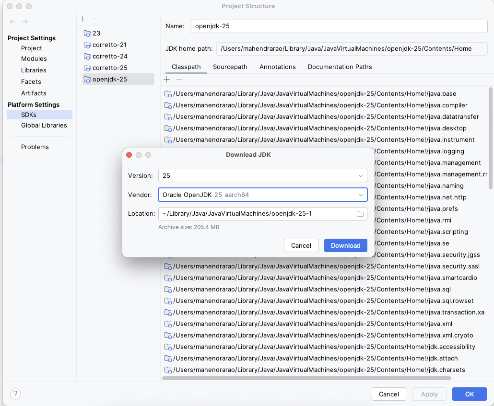
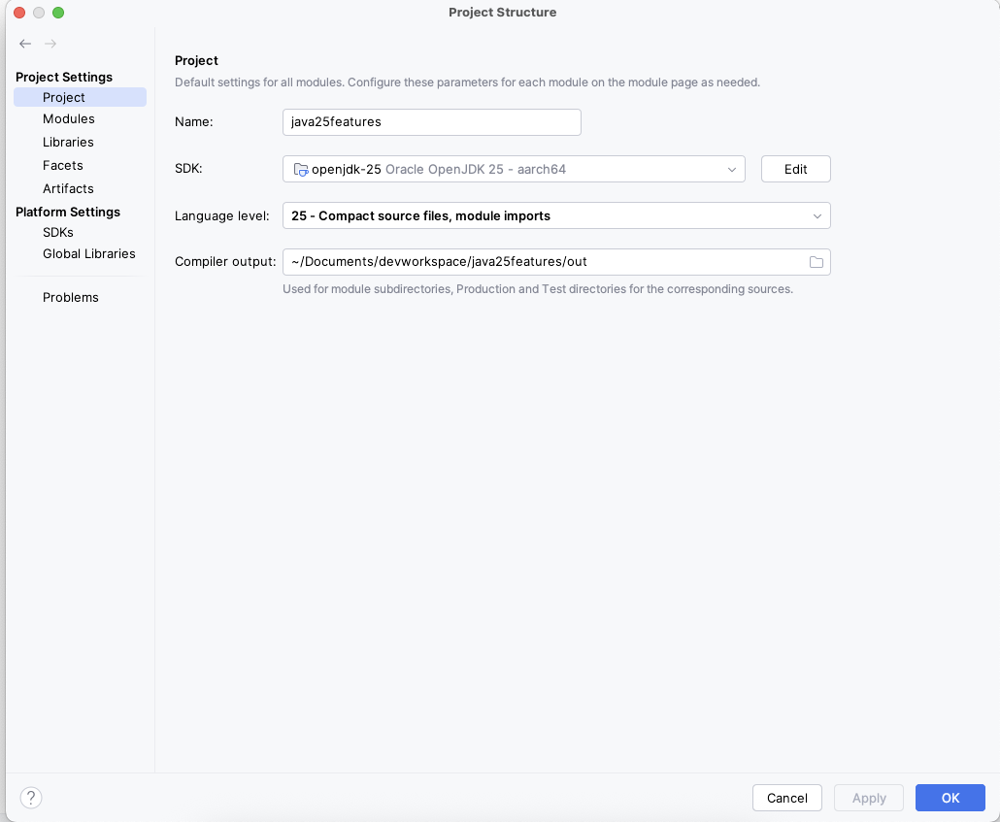

# The Road to Java 25 Features - Verbose to Minimalistic

_On **September 16, 2025**, Java released the 25th version of the Java Development Kit (JDK), designated as
a **Long-Term Support (LTS)** release with support guaranteed for a minimum of eight years.
This release represents a significant advancement over previous versions, introducing a range of enhancements across
the **language, runtime, and tooling**.
JDK 25 notably extends support for artificial intelligence and machine learning workloads through improved APIs and
performance optimizations. These developments are aimed at increasing developer efficiency and facilitating the
development of robust, enterprise-grade applications._

_While this release boosts developer productivity, it also enhances the platform's performance, stability, and security.
Furthermore, it brings renewed confidence in Java’s ability to deliver a robust set of modern features designed to
support next-generation, AI-powered application development._

## Table of Contents

### 1. Language Enhancement Features

- [**Module Import Declarations**](moduleimportdeclarations.md)
- **Compact Source Files and Instance Main Methods**
- **Flexible Constructor Bodies**
- **(_Third Preview_) Primitive Types of Patterns, instanceof, and Switch**

### 2. Library Enhancement Features

- **Compact Source Files and Instance Main Methods**
- **Module Import Declarations**
- **Flexible Constructor Bodies**

### 3. Security Enhancement Features

- **Key Derivation Function API**
- **(_Preview_) PEM Encodings of Cryptographic Objects**

### 3. Performance Enhancement Features

- **Compact Object Headers**
- **Ahead-of-Time Command-Line Ergonomics**
- **Ahead-of-Time Method Profiling**

### 4. Monitoring Enhancement Features

- **Compact Object Headers**
- **Ahead-of-Time Command-Line Ergonomics**
- **Ahead-of-Time Method Profiling**

## Pre-Requisites

#### 1. Download **JDK 25** and Installation

- [Download Java 25](https://www.oracle.com/in/java/technologies/downloads/)
- [Java Installation Steps](https://docs.oracle.com/en/java/javase/25/install/overview-jdk-installation.html)

#### 2. Download IntelliJ IDEA

- [Windows](https://www.jetbrains.com/idea/download?section=windows)
- [MacOS](https://www.jetbrains.com/idea/download/?section=mac)
- [Linux](https://www.jetbrains.com/idea/download/?section=linux)

### How to Download and Set Up **JDK 25** in IntelliJ IDEA

Follow the steps below to download and configure **Java Development Kit (JDK) version 25** directly within IntelliJ IDEA.

---

## Step-by-Step Instructions

### 1. **Open IntelliJ IDEA**
Launch IntelliJ IDEA on your system.

### 2. **Navigate to Project Structure**
- Go to the top menu bar
- Click on `File` > `Project Structure...`  
  *(Shortcut: `Ctrl+Alt+Shift+S` on Windows/Linux or `⌘ + ;` on macOS)*

### 3. **Go to SDKs Configuration**
- In the **Project Structure** window, under **Platform Settings**, select the **SDKs** tab from the left sidebar.

### 4. **Add a New JDK**
- Click the `+` (Add New SDK) button at the top.
- Select `Download JDK...` from the dropdown.

### 5. **Configure the JDK Download**
In the **Download JDK** dialog:
- **Version:** Select `25` from the version dropdown.
- **Vendor:** Choose your preferred vendor, such as:
    - `Oracle OpenJDK 25`
    - `Amazon Corretto 25`
    - `Zulu by Azul 25`
    - `Eclipse Temurin 25`
- **Location:** Leave it as the default, or choose a custom folder where you want the JDK to be installed.

### 6. **Download and Apply**
- Click `Download` to begin the installation process.
- Once the download is complete, the new JDK will be added to your SDKs list.

### 7. **Assign JDK to Your Project**
- In the **Project Structure** window, go to the **Project** tab under **Project Settings**.
- Set the **Project SDK** to the newly downloaded JDK 25.
- Ensure the **Project language level** is set appropriately (e.g., `25 – Preview features` if needed).

### 8. **Click OK/Apply**
- Click `Apply`, then `OK` to save changes and close the Project Structure dialog.

---

## You’re Done!
**JDK 25** is now configured and ready to use in your IntelliJ IDEA project!

