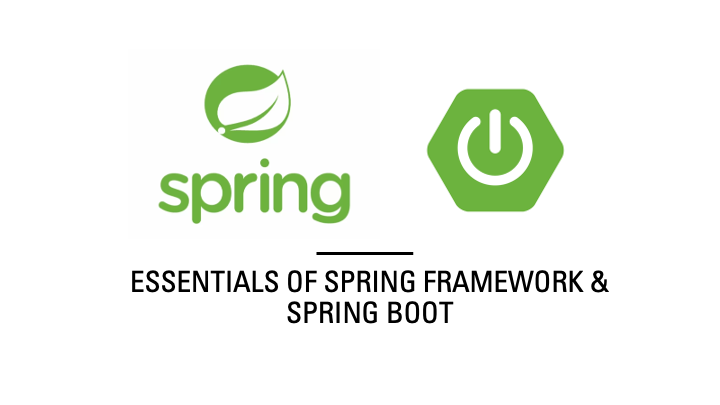

 

1. What is the fundamental philosophy underlying the Spring Framework?  
2. What factors contribute to Spring being regarded as a lightweight framework despite its numerous modules?  
3. What challenges did the Spring Framework initially seek to address within Java EE?  
4. Can you explain Dependency Injection (DI) and its significance within the Spring ecosystem?  
5. What does Inversion of Control (IoC) entail, and how does it differ from conventional object instantiation methods?  
6. What are the various scopes available for a Spring bean, and how does each scope influence application behavior?  
7. What functions do @Bean and @Configuration serve, and how do they connect to XML-based configuration methods?  
8. What role does Spring Boot’s auto-configuration play, and in what ways does it streamline the development process compared to the Spring Framework?  
9. How do the endpoints provided by Spring Boot Actuator differ from traditional monitoring approaches in the Spring Framework?  
10. Why is it essential to have a foundational understanding of the Spring Framework even when utilizing Spring Boot?  
11. How does the management of application properties vary between the Spring Framework and Spring Boot?  
12. What distinguishes the use of @SpringBootApplication in Spring Boot from the combination of @Configuration, @EnableAutoConfiguration, and @ComponentScan in the Spring Framework?  
13. How does Spring Boot facilitate third-party integrations, such as with databases, security, and messaging systems, in contrast to the Spring Framework?  
14. What is the rationale behind Spring Boot offering default configurations, and how can these be customized when necessary?  
15. In which situations would you opt for the Spring Framework instead of Spring Boot, even in the current landscape?  
16. How does the logging mechanism in Spring Boot compare to the manual configuration of logging in the Spring Framework?  
17. What makes Spring Boot more suitable for microservices, while the Spring Framework was initially designed for monolithic applications?  
18. How does the startup time of a Spring Boot application measure up against that of a manually configured Spring Framework application?  
19. What is the key distinction between Spring’s IoC container and a traditional Factory Pattern?  
20. Why are Beans overseen by Spring rather than being created directly by developers?  
21. Under what circumstances would you choose XML-based configuration over annotation-based configuration?
22. How does the implementation of lazy loading for beans affect the performance of applications in Spring?
23. What occurs internally when Spring Boot automatically configures a DataSource?
24. Why does Spring Boot prefer the use of spring-boot-starter dependencies rather than allowing developers to handle version management on their own?
25. What are the consequences of removing Spring Boot’s embedded server and attempting to run the application?
26. What distinguishes the packaging of a Spring Boot application as a JAR from a WAR, and how does this choice influence deployment?
27. What are the implications of excluding a Spring Boot starter dependency?
28. While Spring Boot simplifies the creation of REST APIs, does this eliminate the need for DispatcherServlet? What role does it play in a Spring Boot application?
29. Is the @Transactional annotation sufficient to ensure data consistency? What are the effects of applying it to a private method?
30. If a Spring bean is annotated with @Scope("prototype"), does the @Autowired annotation function in the same manner? What alterations occur?
31. Although Spring Boot eliminates the necessity for web.xml, do servlets, filters, and listeners cease to exist? How are they managed within Spring Boot?
32. Spring Boot automatically generates a DataSource when a database dependency is included. However, what happens if you manually define your own DataSource bean? Does the auto-configuration still apply?
33. What are the differences between @RestControllerAdvice and @ControllerAdvice in Spring Boot, and in what scenarios should each be utilized?
